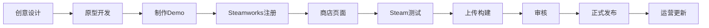
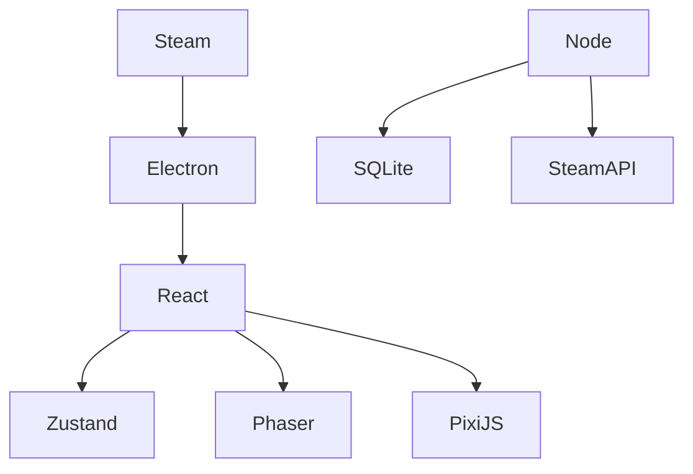
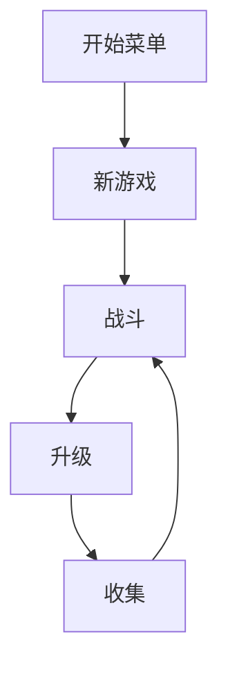

对于前端开发者来说，Steam 游戏开发其实有两条完全不同的路线：

| 路线       | 技术栈                              | 难度   | 推荐指数  |
| -------- | -------------------------------- | ---- | ----- |
| Web技术转游戏 | Electron / Tauri / React + WebGL | ⭐⭐   | ⭐⭐⭐⭐⭐ |
| 专业游戏开发   | Unity / Godot / Unreal           | ⭐⭐⭐⭐ | ⭐⭐⭐⭐  |

如果你本身是 React、Vue、Node.js、NestJS、RN 开发者，建议采用：

**第一阶段：Web游戏 → Steam**
**第二阶段：Unity/Godot → Steam**

这样成功率最高。

---

# Steam游戏发布全流程



---

# 第一部分：Steam开发者账号注册

## 1 注册Steam账号

需要普通Steam账号

官方：

[Steam](https://store.steampowered.com?utm_source=chatgpt.com)

---

## 2 注册Steamworks

官方：

[Steamworks](https://partner.steamgames.com?utm_source=chatgpt.com)

需要：

* 身份信息
* 银行账户
* 税务信息

---

## 3 支付上架费用

每款游戏：

100美元

发布后销售额超过1000美元：

Valve返还100美元

---

# 第二部分：前端开发者最适合的游戏路线

## 路线1：React + Phaser

最推荐

```txt
React
 +
Phaser
 +
TypeScript
 +
Vite
 +
Steam
```

类似：

* 吸血鬼幸存者
* 卡牌游戏
* Roguelike
* 放置游戏
* 经营游戏

---

## 技术架构



---

# Phaser是什么

类似前端版Unity

官方：

[Phaser](https://phaser.io?utm_source=chatgpt.com)

开发方式：

```ts
class MainScene extends Phaser.Scene {
  create() {
    this.add.image(0,0,'bg')
  }
}
```

和React非常接近。

---

# 路线2：React + PixiJS

官方：

[PixiJS](https://pixijs.com?utm_source=chatgpt.com)

适合：

* 卡牌游戏
* 棋牌游戏
* 模拟经营
* 策略游戏

例如：

```tsx
const app = new PIXI.Application()

app.stage.addChild(sprite)
```

---

# 路线3：Tauri游戏

很多前端开发者忽略

实际上：

```txt
React
+
Tauri
+
Rust
+
WebGL
```

比Electron小很多

| 项目  | Electron | Tauri   |
| --- | -------- | ------- |
| 安装包 | 150MB    | 10~20MB |
| 内存  | 高        | 低       |
| 启动  | 慢        | 快       |

---

# Steam是否支持Tauri

支持

本质上Steam只认：

```txt
Windows EXE
Linux Binary
Mac App
```

不关心：

* Electron
* Tauri
* Unity
* Godot

都是一样的。

---

# 路线4：Unity

如果目标收入：

```txt
> 10万元
```

建议直接Unity

官方：

[Unity](https://unity.com?utm_source=chatgpt.com)

---

# Unity对于前端开发者

学习曲线：

```txt
React
 ↓
TypeScript
 ↓
C#
 ↓
Unity
```

其实比想象简单。

---

# 路线5：Godot（强烈推荐）

近年来独立游戏最火

官方：

[Godot Engine](https://godotengine.org?utm_source=chatgpt.com)

优点：

* 开源
* 免费
* 无抽成

脚本：

```python
extends Node2D

func _ready():
    print("Hello")
```

非常像JavaScript。

---

# Steam游戏结构

## 游戏本体

```txt
Game.exe
Assets/
Save/
Config/
```

---

## Steam SDK

Steamworks SDK

官方：

[Steamworks SDK Documentation](https://partner.steamgames.com/doc/sdk?utm_source=chatgpt.com)

功能：

```txt
成就
云存档
好友系统
排行榜
DLC
创意工坊
多人联机
```

---

# 第三部分：制作Demo

Steam最重要：

不是开发

而是Demo

很多开发者死在这里。

---

## Demo要求

至少：

```txt
30分钟内容
完整玩法循环
能保存进度
有音效
有UI
```

---

## Demo结构



---

# 第四部分：Steam商店页

需要素材：

## Capsule

```txt
616 x 353
460 x 215
231 x 87
```

---

## Screenshot

至少：

5张

推荐：

10张

---

## Trailer

1分钟

重点展示：

```txt
玩法
战斗
成长
特色
```

---

# 第五部分：上传游戏

Steam提供：

### SteamPipe

官方：

[SteamPipe Documentation](https://partner.steamgames.com/doc/sdk/uploading?utm_source=chatgpt.com)

上传命令：

```bash
steamcmd
```

例如：

```bash
steamcmd +login username
```

---

# 自动化CI/CD

推荐：

```txt
Github Actions
+
SteamCMD
```

流程：

```mermaid
graph LR

Git Push

Git Push --> Github Action

Github Action --> Build

Build --> SteamCMD

SteamCMD --> Steam
```

---

# 第六部分：审核

审核内容：

* 崩溃
* 黑屏
* 病毒
* 违规内容

通常：

```txt
3~7天
```

---

# 第七部分：正式发布

```txt
设置价格
设置区域价格
选择发布时间
点击Release
```

完成。

---

# 前端开发者最佳学习路线（6个月）

## 第1个月

学习 Phaser

项目：

```txt
飞机大战
超级玛丽
坦克大战
```

---

## 第2个月

学习 PixiJS

项目：

```txt
卡牌游戏
斗地主
炉石Demo
```

---

## 第3个月

学习 Electron/Tauri

项目：

```txt
Steam桌面游戏
```

---

## 第4个月

接入 Steam SDK

实现：

```txt
成就
排行榜
云存档
```

---

## 第5个月

完成Demo

准备：

```txt
截图
视频
商店页
```

---

## 第6个月

上线Steam

---

# 最适合全栈开发者的赚钱方向

如果你的背景是：

```txt
React
Vue
Node
NestJS
RN
Docker
```

建议优先级：

```txt
1. React + Phaser + Electron/Tauri
2. Godot
3. Unity
4. Unreal Engine
```

第一个完整项目建议做：

* 肉鸽（Roguelike）
* 幸存者（Vampire Survivor Like）
* 卡牌构筑
* 自动战斗
* 模拟经营

这些类型对美术要求低，最适合个人全栈开发者从 0 到 Steam 首次上线，通常 3~6 个月可以完成第一个可销售版本。
